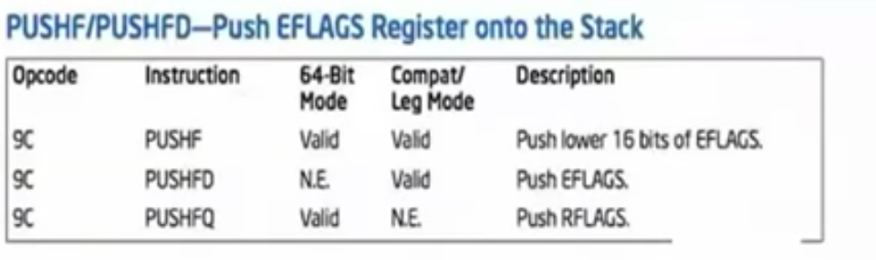

# Intermediate IntlX 86 Processor Architecture & Assembly.

## Part 2:

This course will cover the following :

> Memory Segmentation
> Paging
> Interrupts
> Debugging, I/O

In this lecture, we will dwell on IA-32, not 64 bit architecture yet.(that is for another one, wait for it :))

Also there wont be floating point assembly or registers since in reverse engineering or in malware analysis there is not much of a use for it.

This is what we are goint to learn :) 


## CPUID- CPU Feature Identification.

Different processors support different features. `CPUID` is how we know if the chip we are running on supports newer features, such as hardware virtualization, 64 bitmode(asdasdafa), Hyperthreading, thermal monitors etc.

CPUID does not have operands. Rather it __takes input__ as value preloaded into `eax` (and possible ecx). After it finishes , the outputs are stored to `eax, ebx, ecx and edx`


so if you want your code to be compatible, you need to check some features before implementing.

ID flag in EFLAGS(bit 21), this is the CPUID flag. If it set to 0, you set to 1 and if it stays at 1, then it has CPUID, if it returned back to 0, then you dont have CPUID.
But how do we read and write EFLAGS?

In order to manipulate the flags, we have 2 instructions. 



there are FLAGS which are 16 bits and also there are E(xtended)FLAGS, which are 32 bits. make sure which one to push and pull. the problem occurs because all of them have the same opcode, which is `9C`. the instuction makes the difference.


`PUSHFD`: If you need to read the entire EFLAGS register, make usre you use PUSHFD not PUSHF. The difference is, PUSHFD uses Dword size flags so its not 16 bits but 32 bits.

so PUSHFD takes the flag and puses it to the stack, just like anything else.

opcode for PUSHFD is `9C`


`POPFD`:  There are some flags which will not be transferred from the stack to EFLAGS unless you are in ring 0. these are security purpose flags. we are generally operating on ring 3.   If you need to set the entiure EFLAGS register, make sure you use `POPFD` not just `POPF`, same 16 bit issue.

opcode for POPFD is `9D`


###  Information Returned by CPUID Instruction


CPUIDs are also returning processor manufacturer ID strings. for example,
```
AMDisbetter

CyrixInstead

GenuineIntel

sis sis sis
```

This is what I got running the cpuid.c file in the source files


here `0x16` is actually what is stored in my `eax`. so nothing big.

according to CPUID return value, 0x16 gives this kind of information:

```
Skylake-based processors (proc base & max freq; Bus ref. freq)	0x16	0x8000 0008
```

Infortmation provided about the processor :

EAX: VirtualPhysical Address size
bits 7-0: Physical Address bits
bits 8-15: bVirtual address bits
bits 31-16: reserved


EBX: Reserved=0
ECX:  Reserved=0
EDC:  Reserved=0


>So, rings and modes:

**`Real mode`** is , when you restart the processor it enter the mode called `real mode` anb basically its like compatibility mode. For example when you run DOS now, it runs on this real mode. No virtual memory, no privilege rings, 16 bit mode.

thats it actually.

Most of the OSs run in protected mode. 

**`Protected Mode`**

this mode is the native state of te processor. Among the capabilirties of protected mode is the ability to directly execuce `Real-address mode`. 8086 software in a protected, multi taskin environment. This feature is called **virtual-8086 mode** althouh it is not actuually a processor mode. 

Virtual-8086 is just for backwards compatibility,.

Protected mode adds support for virtual memory and privile rings.

But when cpu is restarting is restarts in real mode and goes into protected mode. so there is a bootstrapping around 16 bit real mode.


**`System Management Mode(SMM) `**

This mode provides an operating system or executive with a transferred mechanism for implementing platform-spesific functions such as power management and system security. in this mode, you have reach all of the memory, hardware support. OS and hypervisor cannot reach to this level. 
The processor enters SMM when the external SMM interups pin (SMI#) is activated or an SMI is received from the advanced progammable interrupt controller (APIC)

THUS, SMM has become a popular target for advanced rootkit discussiuons since access to SMM is locked by BIOS, so that neither `ring 0` nor `VMX` hypervisors can access it! Thus, if VMX us more privileged than ring 0 ('ring -1'), SMM is more privileged than VMX('ring -2') because a hypervisor cant even read SMM memory.!

this is sick! once a kit is hooked to this level, it blocks that memory part and is hidden inside!

`https://github.com/jussihi/SMM-Rootkit` check this for SMM rootkit example


### Privilege Rings

- x86 rings are enforced by hardware.  
- you often hear that normal programs execute in ring 3(user space) and the privleged code executes in ring 0(kernel space).
- in order to understand rings, we need to understand a capability called segmentation


### Paravirtualized XEN!

Requires a modified guest os. 
what is paravirtualization?

Paravirtualization (PV) is an efficient and lightweight virtualization technique introduced by the Xen Project team, later adopted by other virtualization solutions. PV does not require virtualization extensions from the host CPU and thus enables virtualization on hardware architectures that do not support Hardware-assisted virtualization. However, PV guests and control domains require kernel support and drivers that in the past required special kernel builds, but are now part of the Linux kernel as well as other operating systems.

Paravirtualization implements the following functionality

Disk and Network drivers
Interrupts and timers
Emulated Motherboard and Legacy Boot
Privileged Instructions


so instad of guest OS is touching to the hardware, it touches an API and that API controls these requests. 


## SEGMENTATION

**NOTE THAT INX64 ARCHITECTURE, SEGMENTATION IS NOT USED. THIS IS MERELY FOR 32 BIT**


Segmentation provides a mechanism dividing the processor's addressable memory space ( called linead address space) into smaller protected address spaces called (segments)

When we talk about segmentation and segment registers, we are talking about their interactions with the `Linear Address Space` which is actually on the virtual memory **but maps to phsical memory 1 to 1 so it is safe to say that it is pyhical memory __at least until we start to talk about paging.__**

so segmentation therefore taking the code from chunk of memory or instructions and saving them into  ring 3, ring 0 etc.


During this interaction, segment registers take the instuction or data, pipes it through the `segment addressing` process and then undertakes the operation per requested.

But what is segment addressing?

To locate a byte, (finding an address in the memory for example), a **logical address** also called a far pointer must be provided. A logical address consists of a `segment selector` and an `offset`. Offset belongs to the address that is being selected.

So you select the segment first. and within this segment, you select an address, this address selection is made by providing offset of the address

The phsical address space is defined as the range of addresses that the procesor can generate on its address bus.

Phsical address space is  based on how mch RAM you have installed basically. in 32 bit, it is up to a maximum of 4GB since 2ˆ32 = 4GB. But there is a mechanism (phsical address extensions-PAE) which allows systems to access a space up to 64 GB.

`Linear Address space`, on the other hand, in 32 bit systems, is a flat 32 bit space. 


Segmentation is not optional. Segmentation translates logical addresses to linear addresses automatically in hardware by using table lookups.

logical address(far pointer yani) == 16 bit segment selector + 32 bit offset.

if paging is disabled, linear addresses map directly to phsical addresses.


when using a selector of logical address, it goes to segment selector. This segment selector goes to the descriptor table(this is just a big array that holds access - limit and base addresses which we pull) and selects what is needed based on the offset becasue each segment descriptor in the descriptor table holds many addresses, offset is used to specify which one to pull exactly. Once the base address pulled up from the descriptor table, it maps this address to linear address.

think of it like cargo companies.

there is an address parcel needs to be delivered to. this is the base address. We first specify which city and neiggborhood it is in. this is segment selector.

> A nice description below
```
Segment selector says this is in Istanbul_Uskudar. Okay but there are lots of addresses in istanbul uskiudar. then the next piece of information comes. to this selector, we add offset.offset gives the full address and parcel is reached.

so offset is added to the segment selector after segmentation is reached.

after that, hardware maps it to the linear addresses, so that real memory can be reached.
```

### Segment Selectors

A segment selector is a 16 bit value held in a segment register which is also 16 bit.

Segment registers are up to 6. namely they are `CS SS DS ES FS GS `

 It is used to select an index for a segment descriptor from one of two tables:

**Global Descriptor Table** (GPT)
this is for system-wide use


**Local Descriptor Table** (LPT)

Intended to be a table per-process and switched when the kernel switches between process contexts.

Note that the table index is actually 13 bits not 16, so the tables can each hold 2ˆ13=8292 descriptors


index is supposed to match the required offset. based on its position on the array, segment selectors get indexed and offset finds them on index numbers.


### Anatomy of a segment selector


```
15                           3  2  1  0
|-------------------------------------|
|  INDEX                      | T|RPL |
|                             | I|    |
|-------------------------------------|
```

RPL == Requested Privilege level

2 bit value means it can hold values from 0 to 3 so think of it as ring0, ring3

TI = Table indicator

this is one bit. binary. either Global table or Local table where:

0 =GDT

1=LDT

### the Six Segment Registers

- `CS` ==> Code Segment

Hardware always uses the code segment. duriung the code execution, hardware implicity goes to logical address and uses CS register. So in the code you are jumping from 1 to 3, the hardware reads the code and goes to cS and it loooks the table and index and then executes the code. So cs is ALWAYS used implicitly by the hadrware for code access!

Processor differenciates between code access and data access. When we observe a change in `eip` register that is a code access. hardware knows where to go into the memeory to pull the eip and address for the next instruction. but when we move data from here to there, `mov` its the job of the stack segment


- `SS` ==> Stack Segment 

Stack segments are data segments which must be read/write segments. Loading the SS register with a segment sleector for a nonwritable data segment generates a general-protection exception(#GP)

hardware uses the SS for data access. All the data and all the frame is sort if within the SS.

- `DS` ==> Data Segment

Data register is the register that holds and acts on data. rep movs or rep stos for example moves data back and forth between DS and ES.


- `ES/FS/GS` ==> Extra(usually data) segment registers


- the "hidden part" is like a cache so that segment descriptor info doesnt have to be looked ip each time.

> Segments can overlap. code can be data and data can be code. this is very normal.
