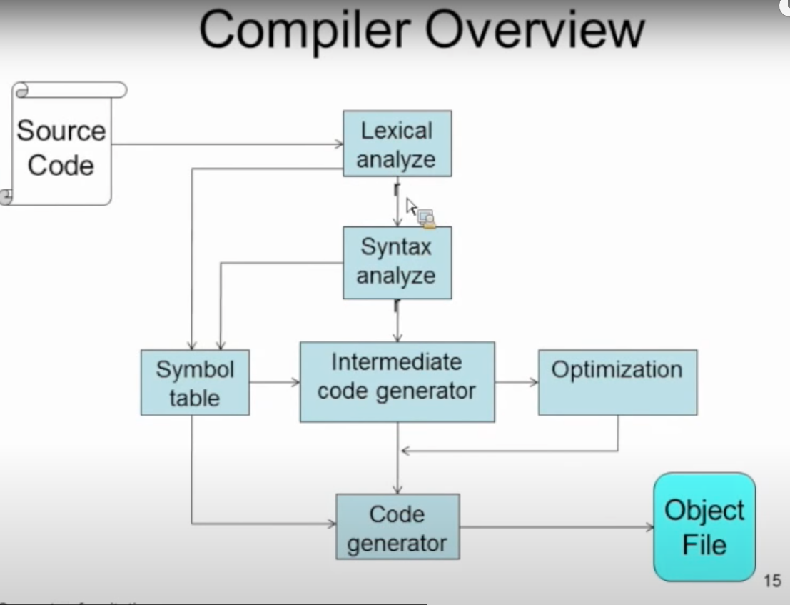

# Life Of Binaries (by Xeon Kovah)

When we write a program in C or C++, and compile it, first, we flat everything on the surface. like all header files, all external/internal libraries are taken from their sources and compiler compiles this code. At the end of the process, we are ended up with a object file, `a.o` 

so during the linking process, linker links all the object and other components and links them together to create the binary.

Upon running, the binary is processed by the OS loader and dynamic linker(runtime linker) for linking the libraries.

so lets say we used `printf`, in runtime linker period, it is obvious that we did not write the function, it is defined elsewhere so it marks down in the binary that `this person needs printf from this library.`

And so loader takes them to memory and you get your program running afterwards.

So linkes is basically : 

`There are 2 or more objects spit out from the previous process, they need to be linked togetger in the desired way. So this sorts and orders these objects and their internals to craete a executably or a library file.`

#### Compilers:

compilers go with the expression trees. In the code , there is an expression tree where code and data are in harmony. For example you declare a variable , and only after that you use it.
So, it is like create stack, open space for var, assign value to a var etc. this is the tree.

Loader loads the binary and checks the FP. Frame pointer register. It can be ARM, X86, RPC etc. In case of X86, starts with the regular stack building.

push ebp.

then, for sake of argument, we have int a =4; what happens, push 4 here. So compiler follows this kind of a tree logic.

#### Executables:

Windows ==> PE (Portable Executable)

Linux ==> ELF (Executable and linkable Format)

Mac ==> Mach-o ( Mach Object)

There are different target binary formats :

> Executable:

.exe on windows, no suffix on Linux. A program which will either stand completely on its own containing all necessary code, or which will request external libraries taht it will depend on.

>Dynamic Library:

.dll on windows and .so in linux.(.so is shared object) needs to be loaded by some other protgram in order for any of the code to be executed. the library may have some code which is **automatically** executed at load time. (the DllMain() on windows or init() on linux) This is as opposed to a library whiuch executes non of its own code and only provides codes to other programs

So these have main() functions basically, when they are called, they got executed

It starts running initialization code, and step by step calls other funcitons or librarues. 

this is where attackers employ **DLL injection attacks**

> Static Library:

.lib on windows and .a on Linux. Static libraries are a bunch of object files with some specific header info to describe the organization of files.

these are used when you want to compile all files together to later be linked against statically. so you say to your linker basically that do not use the `printf` or `scanf` functionj in the standard library but use the one I gave you through the static libray.

> Common Windows PE file Extensions: 

- exe ==> executable file
- dll ==> dynamic link library
- sys/drv  ==> System File (kernel driver)
- ocx => ActiveX control
- .cpl==>Control panel
- .scr ==> screensaver 

So screensavers are full executables, which can deliver malware!

#### PE DOS HEADER

When a PO Dos file is opened and seen, there are bunch of header files are imported and executed. Two of these are 

`WORD e_magic` ==> magic number and `LONG e_Ifanew` ==> file address of new exe header, its an offset to the next instruction

These are contained, alondside many other, under a typedef struct IMAGE_DOS_HEADER typedef function.

so this is a exe header.

`e_magic` ==> is always going to be set to ASCII 'MZ' which is from Mark Zbikowski who developed MS-DOS

For mot windoes programs the DOS header contains a stub DOS program which does nothing but print out `This program cannot be run in DOS mode`

`e_lfanew` ==> this is what we care about mostly. this specifies a file offset where PE header can be found(a file pointer gibi dusun.)

Ben `Peview` ile rastgele bir program actim mesela :) karsima cikan ilk sey :

also at the very first line is MZ :)

and also we have file offset.

so there is .exe, there is 'MZ'  and rthere is DOS MODE sign. three of these are indicates that we are dealign with a windows file :)

#### PE NT HEADER , FILE HEADER

this is Image NT Headers. which containes 3 headers actually. signature, file header, optional header.

Signature == 0x00004550 also known as ASCII string "PE"in little endian order in DWORD. Otherwise, just a holder for two other `embedded` (not pointed to) strucrts.

`IMAGE_FILE_HEADER` and `IMAGE_OPTIONAL_HEADER` are embedded in there, they are not pointed at.

> **__IMAGE_FILE_HEADER__** 

We care about couple of stuff in this header.

the important ones are :

`WORD Machine`

Machine specifies what architecture this is supposed to run on. This is our first incitator about 32 or 64 bit binary.

check the data seciton in the header.

Value 0f `014C` = x86 binary, PE32 binary.

Value of `8664` = X86-64 binary yani AMD64 yani 64bit yani PE32+ binary.

8664 makes sense, 86_64 :)

This does not have to be 100 percent accurate, but gives a clue.

`WORD NumberOfSections`

`DWORD TimeDateStamp`

`WORD Characteristics`

