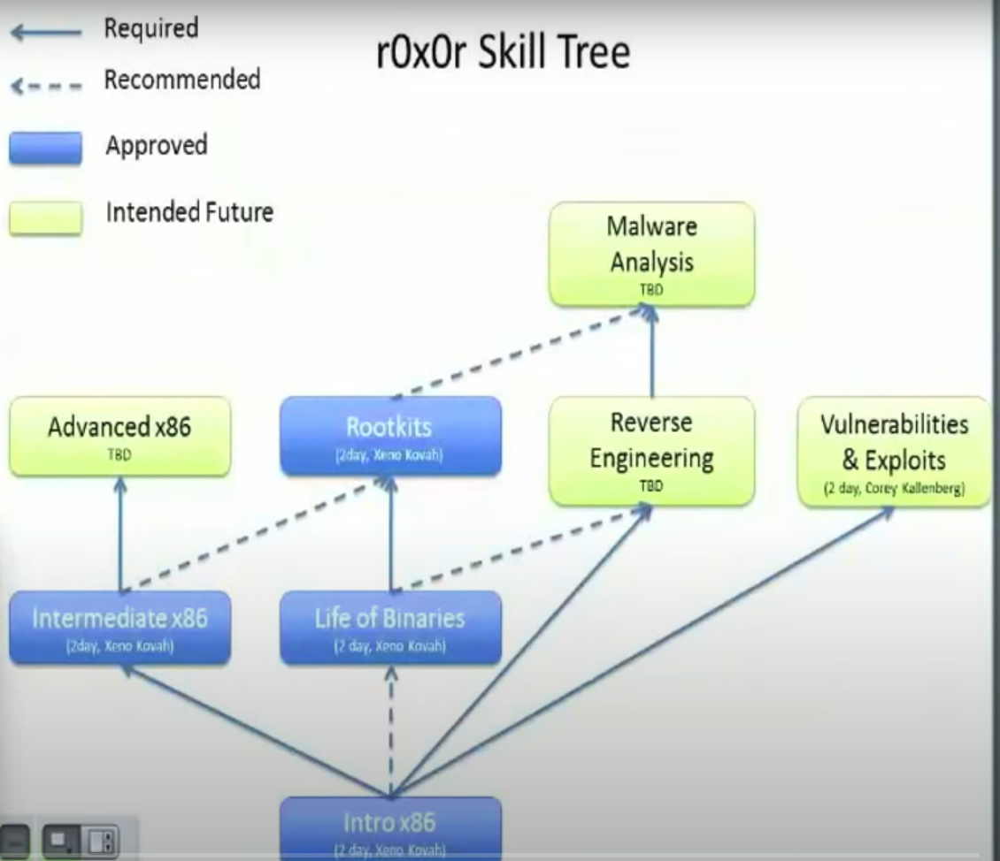

# intel_x86_32bit
My notes from opensecutiytraining.info for personal dev on reverse engineering & malware analysis

## These notes are taken in order to follow the pathway down :

> Intro X86 >> Intermediate X86 >> Life of Binaries >> Reverse engineering >> Malware Analysis.

