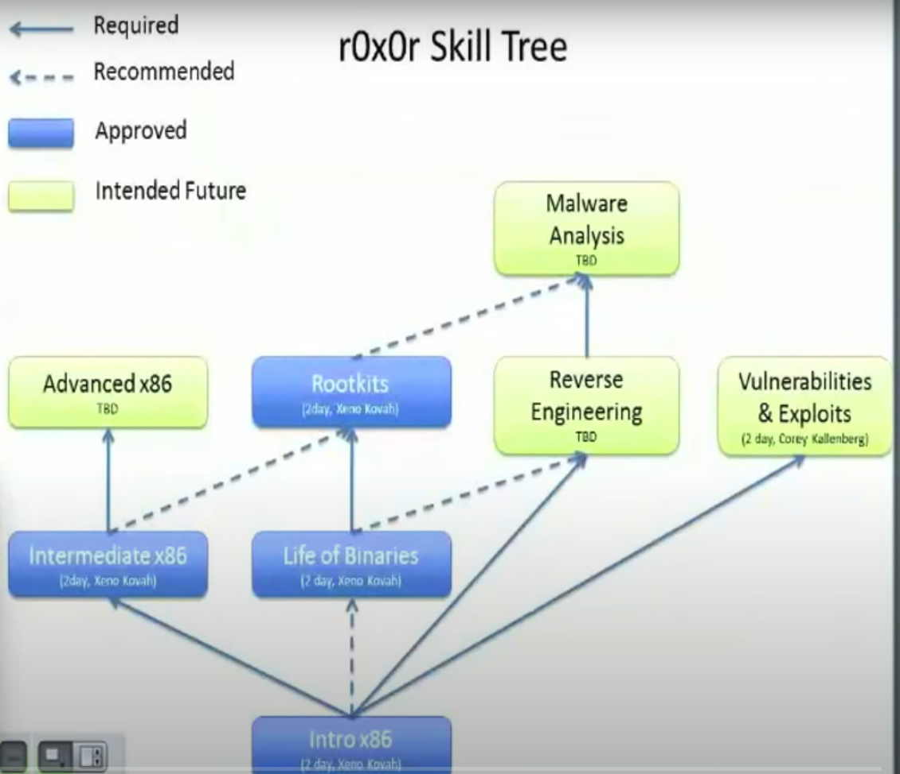

# Pathway

My notes from opensecutiytraining.info for personal dev on reverse engineering & malware analysis

## These notes are taken in order to follow the pathway down :

> Intro X86 &gt;&gt; Intermediate X86 &gt;&gt; Life of Binaries &gt;&gt; Reverse engineering &gt;&gt; Malware Analysis.

## You can find my notes here in pdf and md format

## You can also find the C and Asm files in the source directiories within relative dirs.

## This repo is contantly being updated.

