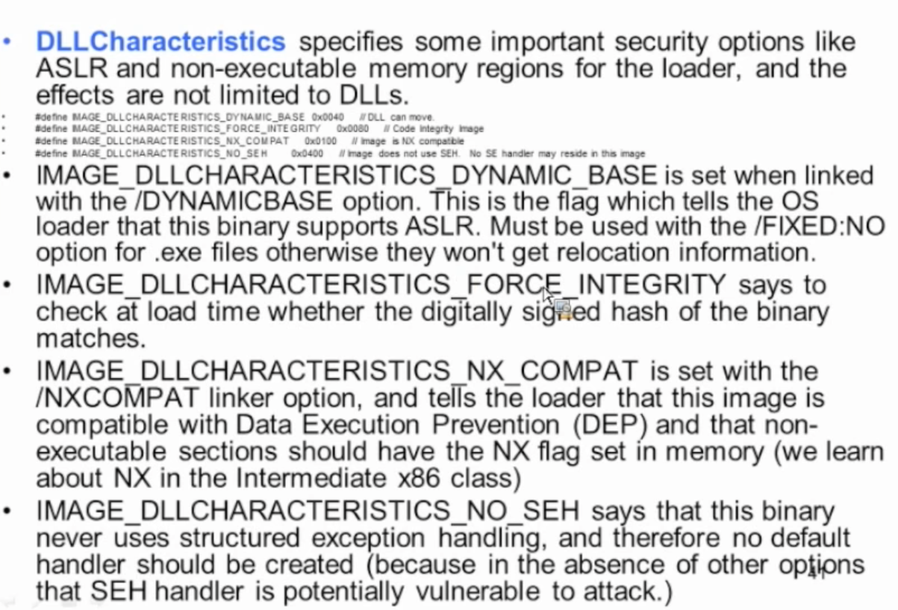
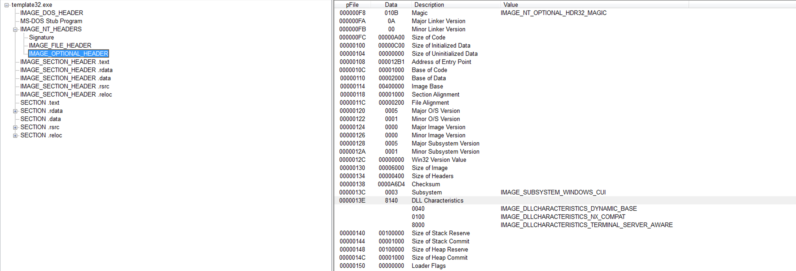
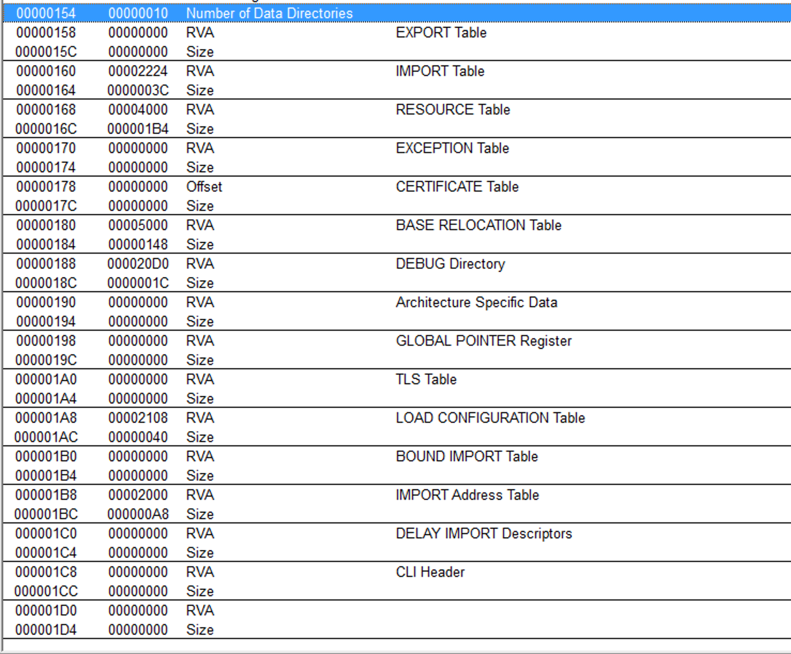
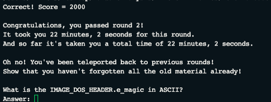
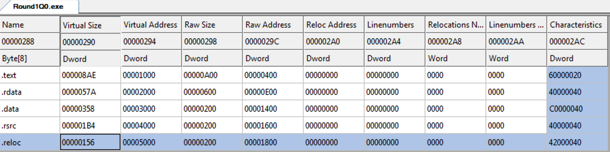

# Life Of Binaries

When we write a program in C or C++, and compile it, first, we flat everything on the surface. like all header files, all external/internal libraries are taken from their sources and compiler compiles this code. At the end of the process, we are ended up with a object file, `a.o`

so during the linking process, linker links all the object and other components and links them together to create the binary.

Upon running, the binary is processed by the OS loader and dynamic linker\(runtime linker\) for linking the libraries.

so lets say we used `printf`, in runtime linker period, it is obvious that we did not write the function, it is defined elsewhere so it marks down in the binary that `this person needs printf from this library.`

And so loader takes them to memory and you get your program running afterwards.


So linkes is basically :

`There are 2 or more objects spit out from the previous process, they need to be linked togetger in the desired way. So this sorts and orders these objects and their internals to craete a executably or a library file.`

## Compilers:

compilers go with the expression trees. In the code , there is an expression tree where code and data are in harmony. For example you declare a variable , and only after that you use it. So, it is like create stack, open space for var, assign value to a var etc. this is the tree.

Loader loads the binary and checks the FP. Frame pointer register. It can be ARM, X86, RPC etc. In case of X86, starts with the regular stack building.

push ebp.

then, for sake of argument, we have int a =4; what happens, push 4 here. So compiler follows this kind of a tree logic.

## Executables:

Windows ==&gt; PE \(Portable Executable\)

Linux ==&gt; ELF \(Executable and linkable Format\)

Mac ==&gt; Mach-o \( Mach Object\)

There are different target binary formats :

> **Executable**:

.exe on windows, no suffix on Linux. A program which will either stand completely on its own containing all necessary code, or which will request external libraries taht it will depend on.

> **Dynamic Library:**

.dll on windows and .so in linux.\(.so is shared object\) needs to be loaded by some other protgram in order for any of the code to be executed. the library may have some code which is **automatically** executed at load time. \(the DllMain\(\) on windows or init\(\) on linux\) This is as opposed to a library whiuch executes non of its own code and only provides codes to other programs

So these have main\(\) functions basically, when they are called, they got executed

It starts running initialization code, and step by step calls other funcitons or librarues.

this is where attackers employ **DLL injection attacks**

> **Static Library:**

.lib on windows and .a on Linux. Static libraries are a bunch of object files with some specific header info to describe the organization of files.

these are used when you want to compile all files together to later be linked against statically. so you say to your linker basically that do not use the `printf` or `scanf` functionj in the standard library but use the one I gave you through the static libray.

> **Common Windows PE file Extensions:**

* exe ==&gt; executable file
* dll ==&gt; dynamic link library
* sys/drv  ==&gt; System File \(kernel driver\)
* ocx =&gt; ActiveX control
* .cpl==&gt;Control panel
* .scr ==&gt; screensaver 

So screensavers are full executables, which can deliver malware!

## PE DOS HEADER:

When a PO Dos file is opened and seen, there are bunch of header files are imported and executed. Two of these are

`WORD e_magic` ==&gt; magic number and `LONG e_Ifanew` ==&gt; file address of new exe header, its an offset to the next instruction

These are contained, alondside many other, under a typedef struct IMAGE\_DOS\_HEADER typedef function.

so this is a exe header.

`e_magic` ==&gt; is always going to be set to ASCII 'MZ' which is from Mark Zbikowski who developed MS-DOS

For mot windoes programs the DOS header contains a stub DOS program which does nothing but print out `This program cannot be run in DOS mode`

`e_lfanew` ==&gt; this is what we care about mostly. this specifies a file offset where PE header can be found\(a file pointer gibi dusun.\)

Ben `Peview` ile rastgele bir program actim mesela :\) karsima cikan ilk sey :


also at the very first line is MZ :\)

and also we have file offset.

so there is .exe, there is 'MZ' and rthere is DOS MODE sign. three of these are indicates that we are dealign with a windows file :\)

## PE NT HEADER ED HEADER:

this is Image NT Headers. which containes 3 headers actually. signature, file header, optional header.


Signature == 0x00004550 also known as ASCII string "PE"in little endian order in DWORD. Otherwise, just a holder for two other `embedded` \(not pointed to\) strucrts.

`IMAGE_FILE_HEADER` and `IMAGE_OPTIONAL_HEADER` are embedded in there, they are not pointed at.

> **IMAGE\_FILE\_HEADER**

We care about couple of stuff in this header.

the important ones are :

`WORD Machine`

Machine specifies what architecture this is supposed to run on. This is our first incitator about 32 or 64 bit binary.

check the data seciton in the header.

Value 0f `014C` = x86 binary, PE32 binary.

Value of `8664` = X86-64 binary yani AMD64 yani 64bit yani PE32+ binary.

8664 makes sense, 86\_64 :\)

This does not have to be 100 percent accurate, but gives a clue.

`WORD NumberOfSections`

Tells how many section headers will be there later.

`DWORD TimeDateStamp`

this is pretty interesting field. It is a Unix timestamp \(seconds since epoch where epoc is 00:00:00 UTC on jan 1, 1970\) and is set at link time.

so bascally how many seconds have elapsed since the epoch.

Can be used as a unique version for the given file.\(this file is compiled on tatata timestamp.\) can be used to know when a file was linked \(**useful for determining whether an attacker tool is fresh or correlating with other forensic evidence keeping in mind that attackers CAN manipulate it.**\)

`WORD Characteristics`

Characteristics field is used to specify many things like line numbers that are stripped, 32 bit word machine , that it is a system file, it cam handle &gt;x GB of ram etc.

> **IMAGE\_OPTIONAL\_HEADER** :

this is a field we do not really care about. SizeOfOptionalHeader can theoratically be shrunk to exclude data directory fields which the linked does not need to include. PointerToSymbolTable , NumberOfSymbols not used anymore now that the debug info is stored in a separate file.

## OPTIONAL HAEDER:

Optional header is not at all optional! It has to be there!

In this header there are 6 entries we care about:

> `Magic`

Optional Header 0.

**Magic is the true determinant** of whether this is a PE32 or PE32+ binary. Depending on the value, the optional header will be interpreted as having a coupe of 32 or 64 bit fields.

**0x10B** ==&gt; 32 bits, PE32 **0x20B** ==&gt; 64 bit , PE32+

0x14C is giving hint maybe, in file headers. but the magic number in optional headers tells OS to how to load, so it is determinant of architecture.

so one field\(0x14c\) can say it is 32 but this may say it is 64, we take this one.

> `AddressOfEntryPoint`

specifies the RVA\(relative address\) of where the loader starts executing code once it is completed loading the binary. Do not assume it just points to the beginning of .text section, or even the start of main\(\).

This is basically saying once you finish all loading and stuff, go to this address and start executing starting from this address.

this is very important!

**so you have a malware and you dont know where it begins executing or it is stripped off, what you can do is to check this value and put a breakpoint for the debugger AND YOU CATCH IT BEFORE IT RUNS ANY CODE!**

Except for one caveat, which is TLS, which will be covered later on.

> `ImageBase`

Image Base is the information pertains to where this program wants to be located in the memory. So in 64 bit system, it wants a 64 bit base, which correspods to ULONGLONG type

In 64 bits, the type is ULONGLONG.

Thus, it specifies the preferred virtual memory locatiuon where the beginning of the biunary should be replaced. If the binary cannot be loaded at ImageBase\(for example something else is running that memory\) then the loader picks an unused memory range. Then , every loaction in the binary which was compiled assuming that the binary was loaded at ImageBase must be fixed by adding the difference between the actual ImageBase minus desired Image base.

The list of places must be fixed and kept in a special `relocations` \(.reloc\) section.

Hence, Microsoft does not support position-independent code.

On linux systems, shared libraries will be executed as position independent code.

> `SectionAlignment`

specifies that sections must be aligned on boundries which are multiples of this value. for example, if it is 0x1000, then you might expect to see sections starting agt 0x1000, 0x2000, 0x5000 etc.

0x1000 is size of a page in intel 32 systems.

> `FileAlignment`

data was written to binary in chunks no smaller than this value. some common values are 0x200, \(512, the size of a HDD sector\) and 0x80,\(size of sector in floppy.\) SSDs use 4KB size.

this is from AskUbuntu.com:

```text
In the old days, 512 byte sectors was the norm for disks. The system used to read/write sectors only one sector at a time, and that was the best that the old hard drives could do.

Now, with modern drives being so dense, and so fast, and so smart, reading/writing sectors only one sector at a time really slows down total throughput.

The trick was... how do you speed up total throughput, but still maintain compatibility with old/standard disk subsystems? You create a 4096 block size that are made up of eight 512 byte physical sectors. 4096 is now the minimum read/write transfer to/from the disk, but it's handed off in compatible 512 byte chucks to the OS.

This means that even if the system only needs one 512 byte sector of information, the drive reads eight 512 byte sectors to get it. If however, the system needs the next seven sectors, it's already read them, so no disk I/O needs to occur... hence a speed increase in total throughput.

Modern operating systems can fully take advantage of native 4K block sizes of modern drives.
```

Also according to Intel.com, `Intel® Solid State Drives support a 512 byte and 4096 byte (4K) physical sector size.`

EZ. Take this much of a bunch and write it this much. 512 bloklar halinde yani.

If you dont have multiples of hex 0x200, then you need to put some paddings file before putting the next section. lets say your file is 10 bytes,

you write it and pad it until the next file offset , end of 512. and keep writing the next section

> SO FILE ALIGNMENT IS HOW YOU ALIGN ITEMS ON DISK WHEREAS SECTION ALIGNMENT IS HOW YOU ALIGN THEM ON MEMORY
>
> `SizeOfImage`

this is the amount of contiguous memory that must be reseved to load the binary into memory.

Os loader goes through code and accumulates all the required amount of memory , this plus this plus this etc, so it knows exactly how much memory it needs. `sizeOfImage` basically gives this total amount.

This is the total size of the binary once it is mapped to the memory

> `DllCharacteristics`

Specifies some more important **security options like ASLR and non-executable memory regions for the loader and the effects are not limited to DLLs**



If the `Fixed Base Address` is set to Generate a relocation section, it means that /FIXED:NO flag is set and it generates relocations.



in this pictiure, the part under the DLLsections on the right panel shows some info

DynamicBase == ASLR is ON NX COMPAT == DEP/NX feaure

and on the left panel, down there are sections , particularly `SECTION .reloc` this holds the data for relocations

> So `Does this support ASLR?` means is the `Dynamic Base Flag is set?`.

#### DataDirectory\[IMAGE\_NUMBEROF\_DIRECTORY\_ENTRIES\]

Array of officially 16 things and this is the storage of pointers from all of this other data structure that we are go over.

This holds pointers of what exports it holds,

it holds pointers to what functions and import it holds

it holds the pointers where the debug infromation can be found, where the digital signature is, where the relocation informatiion is, where the resources are etc.

super informative header!!

It is like a big map that points at tll the other data structures.

An example can be seen below:



> Playing bitHunt Scavenger level 2 here is my result



## SECTION HEADERS:

Section group portions of code or data which hae similar purpose, or should have similar memory permissions.

Number of section headers can be found where? at `File headers` section.

This groups similar memory permissions , bunches them up and then let the OS loader loads same permissions once they are mapped in memory

So think of the role of linker? links all these different objects and data etc? It works like this:

Take this bunch, this is executable but not writable; this data is only readable, that one is executable and writable. these bunches and permissions.

and then linker links all of them into the final form of the binary

**so what are the common seciton names?**

* **.text**

  Code which should never be paged out of memory to disk. This is where the actual code goes. Especially in windowns kernel, some code can be load onto memeory or etc, but .text one is always non-pageable, it never is paged to disk.

  it always stays on memory

* **.data**

  read/write data\(globals\). So for example some code resides in stack, like local variable etc. \(in linux this is .rodata\) these are strings, global variables that can be used in different places.

* **.rdata**

  read-only data\(strings\)

* **.bss**

  Block Started by Symbol or Block Storage Start, depending on who you ask :\) In practice, the .bss seems to merged into the .data section by the linker for the binaries

  Takes up space in memeory but not in disk. actually linker links and merges the bss section with the text section or it is merged with the data section.

* **.idata**

  Import address table. In practice, seems to get merged with .text or .rdata

* **.edata**

  Export infromation

All these can be seen accross diffrent file formats, different operating systems. so it is a shared value.

idata and edata will get merged with .data section so we wont see them in PE analysis section in section.

* **PAGE\***

  code/data which it is fine to page out to disk if you are running low in memory.

  Essentially means that these section names in kernel modules will be like `Page verify` or `Page Log`\(lock?\). so these sections are prefixed with `PAGE`.

* **.reloc**

  Relocation information for where to modifyhardcoded addresses which assume that the code was loaded at its preffered base address in memory.

  if data needs to be moved around, it is needed to be known that this is the data strructure, here is the important piece of information etc.

* **.rsrc**

  Resources. Lots of possible stuff from icons to other embedded binaries. the section has structures organizing it sort of like a filesystem.

  some rootkits actually hide behind this and show thyemselves as resources, then when they are dumped they are loaded into kernel modules and running in the kernel etc.

  `Stuxnet` for example, used explorer.exe and .rsrc to load itself into the system.

* **.pdata**

  ARM, MIPS, and SH Windows CE compiles use PDATA structures to aid in stack walkint at run-time. This structure aids in debugging and exception processing.

NOTE: IMMEDIATELY AFTER THE OPTIONAL HEADER , THE OS LOADER EXPECTS DATA SECTION. IF THERE IS EVEN A BYTE LONG PADDING, IT CONFUSES THE OS LOADER.

this is how Section Headers are :



lets explain those column names:

### SECTION HEADERS EXPLAINED:

* **NAME\[8\]**

  Name is a byte array of ASCII characters. It is NOT guaranteed to be **null terminated**. So if you are trtying to parese a PE file yourself oyu need to be aware of that.

  You can put whatever you want in there.it is generally for the human or linker, loader does not care about it at all.

* **Virtual Address**

  is the RVA of the section relative to OptionalHeader.ImageBase

* **Pointer to Raw Data**

  is a relative offset from the beginning of the file which says where the actual section data is stored.

> **NOTE**

```text
RVA == the virtual address.

where is it mapped on the memory?

Actual Value = ImageBase + RVA.

Because RVA is an offset, we can just add RVA and ImageBase and get the Actual base value, which is the mapped address on the memory
```

## PE IMPORTS:

#### \#\# Static Linking vs Dynamic Linking:

Static linking is on compile time VERSUS dynamic is runtime!

with static linking, you literally just include a copy of every helper function you use inside the executable you are generating.

Dynamic linking is when you **resolve pointers** to functions inside libraries **at runtime**

A statistically lniked executable is bloated compared to a dynamically linked on. But, on the other it is standalone, without outside dependendcides.

