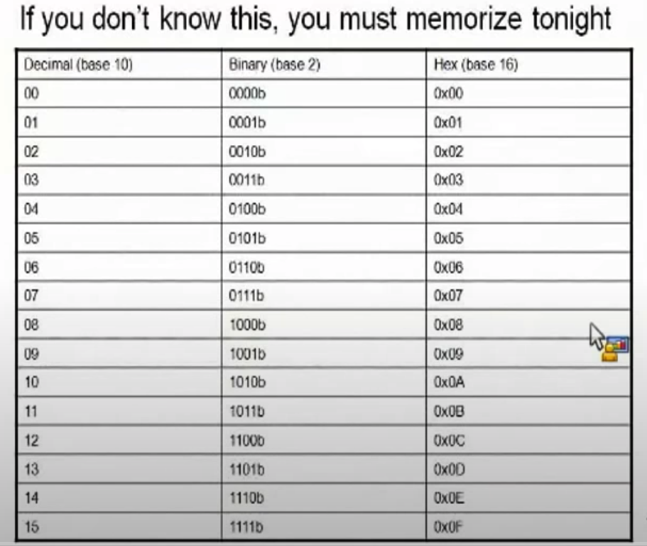
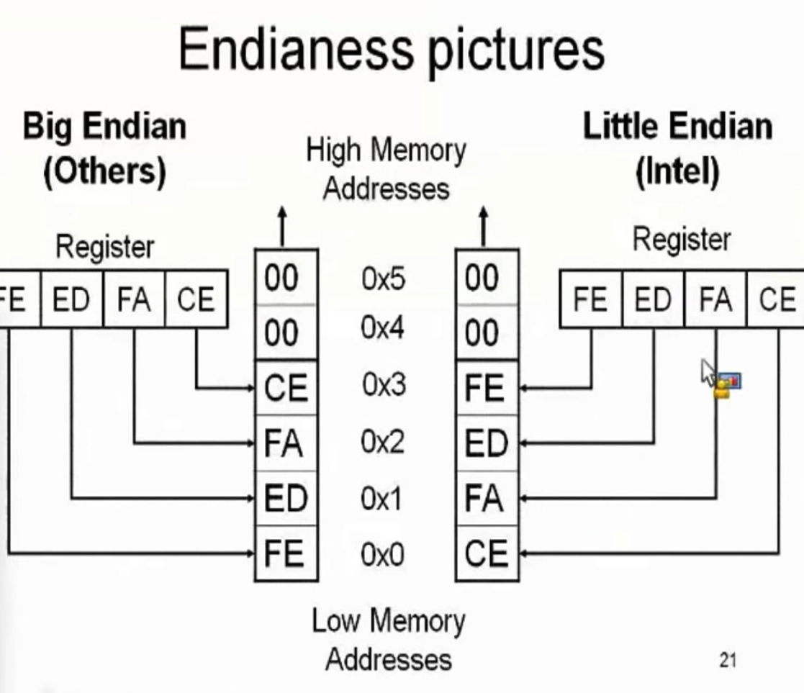
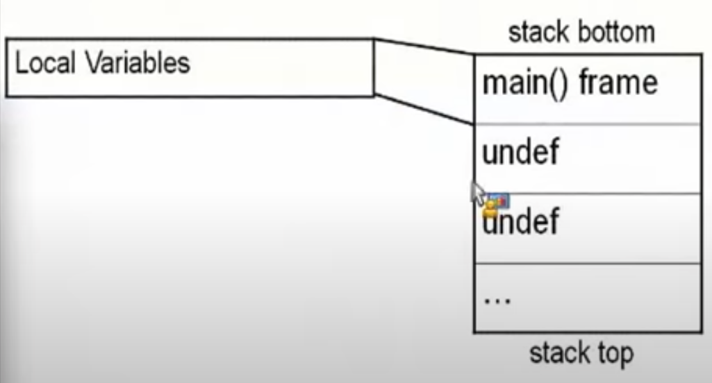
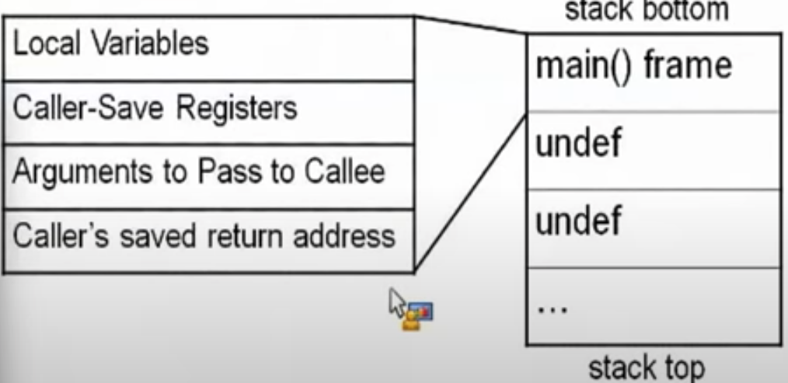
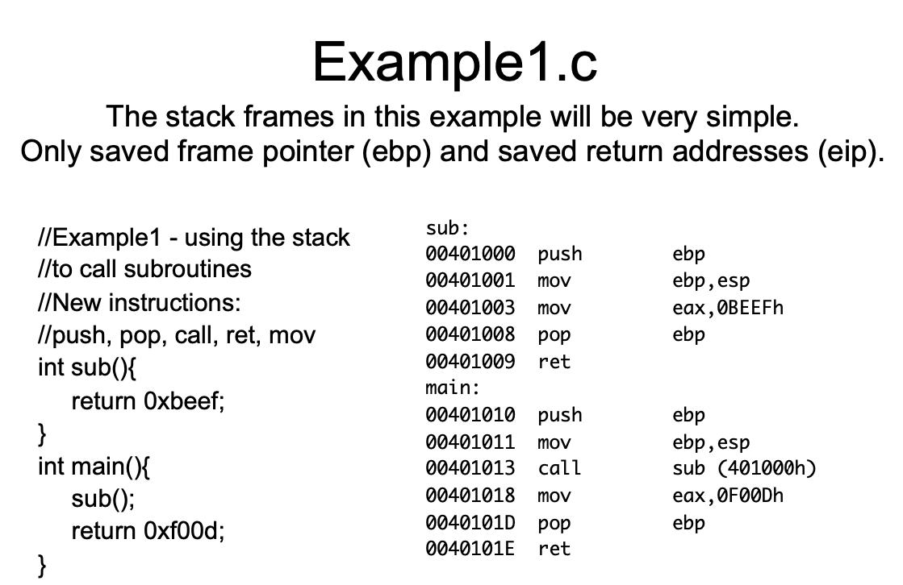
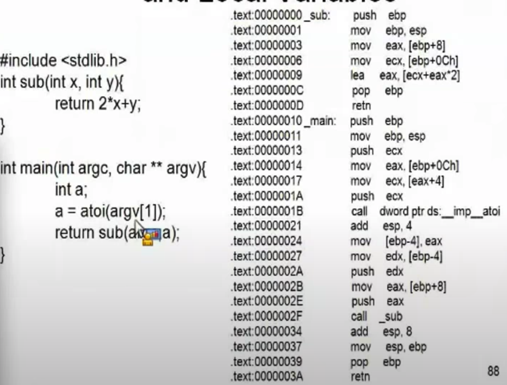
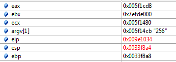
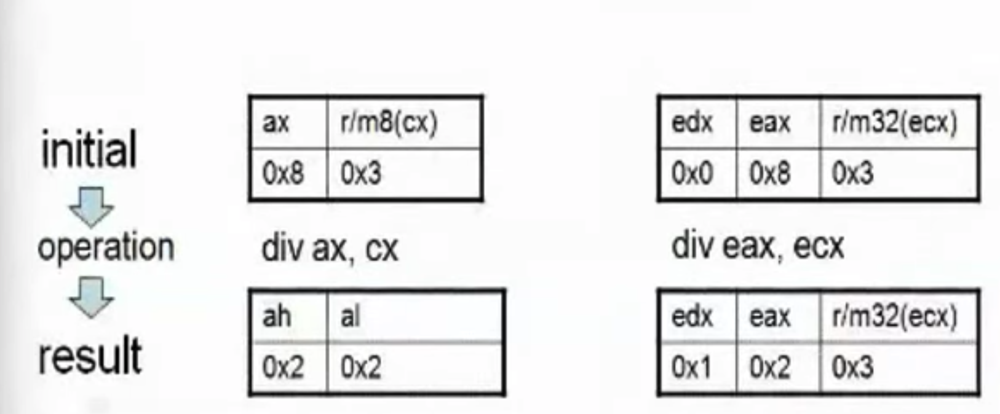

# Intel X86 Processors 


> only 14 assembkly instructions make up to 90 percent of the code!

 in intel terminology : a byte is a char(8) , a word is a short(16), int/long is double word(32), double long(64) 

 

 Intel is little endian. 0x12345678, least significant bit is registered first, then more significant and more significant.



Endians are only meaningful in byte level not in bit level!


Register Conventions!

`EAX` ==> stores function return value
`EBX` ==> Base pointer to the data section 
`ECX`==>counter for string and loop ops
`EDX` ==> I/O pointer 
`ESI`==>source pointer for string operations
`EDI`==>Destination pointer for string operations
`ESP`==>stack pointer
`EBP`==>Stack frame base pointer
`EIP`==>pointer to next instruction to execute(instruction pointer)


There are also other type of registers.

`EAX, EDX , ECX` == > Caller-save registers 

I am a function and I will call another function. And when I call I am sure I am going to destroy the current regusters(eax edx ecx)
so we save the copy of the registers before calling the function so we do not lose the register  


`EBP, EBX, ESI, EDI` ==> Callee-save registers  

If I call a functiion, it wont change and modify the info in the register of ebp, ebx etc. 


this `E` at the head of registers mean Extended. Since these are written originally for 16 bit , AX became Extended AX with 32 bits. etc.


`EFLAGS`

EFLAGS register holds many single bit flags. Will only ask you to remember the following for now :

Zero Flag(ZF)- Set if the resuklt of some instruction is zer, cleared otherwise
Sign Flah(SF) - Set equal to the most significant bit of the result.

## INSTURCTIONs

`NOP` No Operation. No registers no values nothing.  Just there to pad bytes or delay time.  Bad guys use it to make simple exploits more reliable. But thats another class.

NOP actually takes a register and re-registers it on itself :)


`PUSH` ==> push word, double word ort quadword onto the STACK.  can either be emmediuate(a numeric constant) of the value in a register.

fror our purposes, it will; always be a DWORD(for this course)
the push instruction aautomatically decrements the stack pointter, esp, by 4. Why decrements? bcs its stack, its FILO.

`POP`  ==> Pop a value from the Stack

take a Dword off the stack, put it ina a register and increment esp by 4 ( reverse of Push)


`CALL` ==> Call's job is to transfer control to a different function in a way that control can later be resumed where it left off.

First it pushes the address of the next instruction onto the stack.  for use by RET(return from procedure) for when the procedure is done.

Because idea behind a function is , do this and I will keep executing from the next line. So call also pushes the address of the next instruction set, so that once the called function is completed, the program keeps continuing from where it left off. Its a reminder to where to return to after executing the function.

Then it changes eip to the address given in the instruction.

DEstionation address can be specified in a multiple ways. 

- Absolute address  ==> address 0x0030434 

- Relative address(relative the the end of the instruction) ==> some adress that hex 50 bytes ta ta ta. 

`RET`==> Return from Procedure.

Two forms :

1) pop the top of the stack into the eip

in this form, the instructuon ius just written as ret.

typically used by cdecl functiuons

2) pop the top of the stacj into eip and add a constatn number of bytes to esp. 

in this form , the instruction is written as ret 0x8 of 0x20 etc. typically used bty stdcall fucntions


`MOV` ==> Move.

Can move:

register to register

memory to register, register to memory, immediate to reguster immediate to memory.

immediate is hardcoded value. 

> NEVER MEMORY TO MEMORY

>Memory addresses are given in r/m32 from. 


`ADD` ==> a = a+ b    for example add eax,ebx  means  eax = eax + ebx.  so it summs them and writes on what is on the left side

`SUB` ==> subtraction. sub eax, [ebx*2]

`LEA` ==> Load Effective Address.  ==> frequently used with pointer arithmetic sometimes for just arithmetic in general. uses the r/m32 form but **is the exception to the rule**

Lea makes the calcualtion and appoints to the destination without disturbing the memory. Does the calc on the spot.


that the [] syntax means dereference("value at")

example: ebx = 0X2, edx =0x1000      --- lea eax,[edx+ebx*2]   **eax = 0X1004, not the value at 0x1004!!**


`JMP` ==> Jump. Changes the eip unconditionally of the given address. Main forms of the address.

short relative : 1 byte displacement from the end of the instruction.

`01151015  jmp        1155000h` doesnt have the number `1155000h` anywhere in it, it is really `jmp 0x0E` btyes forward.

near relative: 4 bytes displacement from the curent eip

absolute: hardcoded address in instruction. like `01151013  jmp         01151023 `

absolute indirect : indirect address calculated with r/m32

`jmp -2` is infinite loop for short relative jmp :)

Conditional Jumps: `je, jge, jne, jle`


`JCC` ==> Jump if Condition is met. 

`JNE` == `JNZ` jump if not equal means jump if not zero. What does it mean ? jne a b for example. the operation is a-b. so flag is either 0 or <0 or 0> 

so 0 means equal. if not equal, its not zero. So it makes zero flag check


`TEST` ==> computes the bit-wise logical AND of first operant(source 1 operand) and teh second operand(source 2 operand) and sets the SF, ZFand PF staus flags accordingly.

like CMP, sets the flags and does not save the results

`AND` ==> destination operand can be r/m32 or register. source operand can be r/m32 or register or immediate!

`and al, bl`

`and eax, 0x42`


`OR`==> destination operand can be r/m32 or register. source operand can be r/m32 or register or immediate!


`XOR` ==> A xor B = If A , then A ; else then B.

there is a trick with XOR, when we xor something with itself, the result will always be 0. so ZF will be set.  `xor eax eax` sets the Zero Flag in that sense

thus, it is commonly used to zero a register by XORing it with itself because it is faster than `mov`.

`NOT` ==> single source/destination operand can be r/m32. One's complement negation.  

`not al` or `not [al+bl]`. 

example : 

```
NOT 0x00110011b(al-0x33)
result 0x11001100b((al-0xCC))


```
`SHL` ==> Shift Logical Left. Can actually be used with the C and C++ << operator.

first operand(source and destination) operand is an r/m32 

second operand is either a cl(lowest byte of ecx) or or a 1 byte immediate(hardcoded).

the 2nd operand is the number of places to shift


> it multiplies the register by 2 for each placeteh value is shifted. More efficient than a multiply insturction.

bits shifted off to the left hand side are `shifted into` (set) the carry flag.(CF)

`SHR` ==> Shift Logical Right

Same thing with SHL, but this time each bit registers divide by power of that bit.

like 
`shr eax, 5  ==>  divide eax with 2**5(32) and write it on eax.`

Still much effective than division and faster. becasue just shifting bits around.

when shifting bits to right so much so that it is now outbound of 8 bits, Carry flag(CF) is set to 1 to show that it is not actually 0 but it is carried. 


`IMUL` ==> signed Multiplier. 3 forms:

1) imul r/m32  ==> edx:eax=eax*r/m32

for example : `imul ecx` take single parameter.

what does this mean : multiply ecx with eax and write the return to edx:eax

2) imul reg, r/m32 ==> reg=reg*r/m32

for example : `imux eax,ecx`

so eax times ecx and puts it back into eax.

if there is a chance for overlow, we make some modifications so it fits into the first form.


3) imul reg,r/m32, immediate   ==> reg=r/m32*immadiate

Multiplication and division have some possible side effects. For example, multiplication of two 32 bits may exceed the bounds of 32 bits of data.

Easiliy.

Thus, it is saved to edx:eax, so that it fits onto 64 bits.

note that `edx:eax` means concatenation. When eax is saved onto edx:eax it means the result of the operation is outbound of 32 bit limits!.

in 32 bit architecture, in this kind of a scenario, half of the result it written on edx and half of it written on eax and compiler figures out to how to output it.


`DIV` ==> Unsigned Divide.

2 Forms: 

1) divide ax(16 bit of eax) by r/m8 , al=quotient, ah=remainder

2)edx:eax by r/m32, eax=quotient,edx=remainder

if the divisor is 0, a `divide by 0 exception` is raised.


`REP STOS`


## THE STACK

stack is the conceptiual area of main memory which is designated by OS when program is started. Stack is LIFO/FILO data structure where data is pushed on to top of the stack and popped off the top

Stack grows over lower memory addresses. Adding something to the stack means the top of the stack is now at a lower memory address.

ESP points to the top the stack. The lowest address which is being used(since it is LIFO)

Stack keeps track of which functions were called before the current one. It holds LOCAL VARIABLES and is used to pass arguments to the next function to be called


Register in time 1 : 

eax : 0x00000003
esp : 0x0012FF8C

So when we call lets say , `posh eax`, we expect the eax to be written 4 bytes after(decrement) the last esp register in the stack.

Register after push eax:

eax: 0x00000003
esp:0x0012FF88    ==> here, we jumped 4 bytes from FF8C to FF88. (where FF8C>FF88)


to reverse it , we use `POP` 

in order to reverse the action above, we `pop eax`and voila, esp jumped by 4 bytes up ( incremented) and top shelf of the stack is emptied.


> Everything numerically under esp is considered to be undefined. Although there is a data over there, it is not of our business. 

> once we call pop eax, the the value at the top of the stack (eax) is taken to the register and that memory spot is not undefined.


### Calling Convention

calling convention is about how to pass parameters and how to get parameters back.

how code calls a subroutine is compiler-dependent and configurable. But there are few conventions. We will deal with cdecl and stdcall conventions.

### cdecl

C Declaration. The most common calling convention. Function parameters pushed (using push)  onto stack RIGHT TO LEFT. Saves the old stace frame pointer and sets up a new stack frame.  

eax or edx:eax returns the result for primitive data types.

Most significant 32 bits go into edx, least significant bits go into eax

Also values are always big endian in registers, in memory they are little endian.

so for example :  `printf(%d\n, myVariable)`  ===> from right to left: push my variable to the stack then ppusth the pointer and trhen call the function.

function here, saves the old frame pointer, saves the address to the stack.

`Caller` is responsible for cleaning up the stack.  ==> 

so we have 2 parameters and 1 function call. push push and call. so whatever regiester is calling the function is also responsible to clean up the stack


### stdcall


Microsoft C++ code e.g. Win32API
parameters pushed onto stack right to left
saves the old stack frame pointer and sets up a new stack frame pointer

HERE, CALLEE is responsibnle for cleaning ip any stack parameters it takes not the CALLER!


## General Stack Frame Operation

We are going to assume that the main() is the very first function being executed in a program. This is what its stack looks like to start witrh.




Low addresses at the bottom, high addresses at the top.

The more I add to the stack, the more I expect it to grow to the bottom.

So first thing main does is to preserve space on the stack for the local variables. When main() decides to call a subroutine, main() becomes the caller. We will assume main() has some registers it would like to remain the same, so it will save them. We will also assume that the callee function stakes some input args. 

so , local variables, caller-save registers, and Args to pass to callee are in main() stack frame at the bottom of the stack.

so right to left, local variables, caller-save registers, args to pass to callee and then function call.
git 
when we execute the call instruction, the return address(RET) gerts save onto the stackm and becuse the next instruction after the call will be the beginning of the called function, wer consiter the frame to have changed to the callee.




next, when subroutine starts, the frame pointer(ebp) still points to the main()'s frame. so tthe first thing it does is to save the old frame pointer on the starck and set the new value to point to its own frame.

so at the main() fnction, ebp is pointing at the top of the frame. when a subroutine is called, it will save this adress to stack , take the ebp and contibnue its function, once the function is finished, it will restore the value of ebp so that the next subroutines can take up to from original ebp register.


> STACK FRAMES AR A LINKED LIST!

    The ebp in the current frame points at the saved ebp of the previous frame





```c
int sub(){
    return 0xbeef;
}

int main(){
    sub();
    return 0xf00fd;
}
```

```asm
NOTE :  ON INTEL REGISTERS AND CALLS, DESTINATION IS ON THE LEFT AND SOURCE IS ON THE RIGHT

SO

MOV EBP,ESP MEANS

Move esp TO EBP!!!

IN AT&T syntax, this is the opposite tho.
```

```
sub:

00401000 push ebp
00401001 mov  ebp,esp
00401003 mov  eax,0BEEFh
00401008 pop  ebp
00401009 ret

main:
00401010 push ebp
00401011 mov ebp,esp
00401013 call sub(401000h)
00401018 mov eax,0F00Dh
0040101D pop ebp
0040101E ret
```

note : push ebp    mov ebp,esp  codes are generated by compiler automaticaly


```asm
main:
00401010 push ebp
```
when code started to executing, there was some value in ebp. so initially, main pusheh ebp(base pointer).
so when we push ebp, since esp always points to the top of the stack, we also see that esp is also changed.

stack is decremented by 4 bytes with this push since it pushes stack to down(LIFO)

`mov ebp,esp`  means take whatever value in the esp and put it onto ebp. because intel x86 syntax is `instruction destination,source`

so now ebp and esp are the same. so whatever is at teh address of ebp and low is the new stack frame.

`00401013 call sub(401000h)` in the main function is very self-explanatory. call the function called sub at the address of 401000h which is the beginning of the address of sub.

so what is at the stack now ?

```
00401013 call sub(401000h)
00401018 mov eax,0F00Dh
```

subroutine(function sub) needs to register the address of the next register so that after the execution of the subroutine, main function picks up from where it left off. hence, the address of mov eax,0F00Dh is registrered to the stack.

now the stack is hosting 00401018 right after ebp.

next step is to calling sub routine. when subroutine is called, it will save the ebp to the register (push ebp) this ebp is pointing at the main function normally. then it will move esp to ebp like main function(mov ebp,esp). now ebp and esp are pointing at the same place. why `mov ebp,esp` is important? **by setting esp to ebp, sub is creating its own stack**!!
next step, sub can start functioning, which is writing 0X0BEEF to eax. 

why? because eax holds the return values and the sub() function was only returning 0xbeef;. thus it makes sense!

thus , in the stack, eax is changed to 0x0000BEEF address since this is our return value.

now sub() function is executed and we do not need the base pointer anymore. next step is pop ebp since this is the end of the stack.

end we will exit the sub() function with `ret`.

what `ret`does is that whatever is on the top iof the stack, go ahead and take it from there and I will put there the insturction pointer and so this will be our next destination.

remember the code :


```
sub:

00401000 push ebp
00401001 mov  ebp,esp
00401003 mov  eax,0BEEFh
00401008 pop  ebp
00401009 ret

main:
00401010 push ebp
00401011 mov ebp,esp
00401013 call sub(401000h)
00401018 mov eax,0F00Dh
0040101D pop ebp
0040101E ret
```

so when `ret`  (0x000401009) is called, the top of the stack will have the value of will be replaced to what? 

it will be replaced with `0x000401018` since this is the first address after the sub() function call. thus main() function will keep goint from here. so next step is `00401018 mov eax,0F00Dh`

whici moves the value 0x00F00D to the eax because is the return value. if we did not put this register, the eax would be stil under the effect of sub() function so would keep pointing at 0x00BEEF. but main() wants a return of 0xFOOd so we immediately overwrite it.

next, we tear down the stack with `pop ebp` and returning to the function.

with pop ebp and ret, we cleared the last 2 remaining registers of stack. now stack is all undefined.


Some notes: 

since sub() is a deadcode , meaning its return value 0xFOOD, is not used for anything, compiler with optimization option on would delete sub() function.

because there are not input parameters to sub(), there is no diff whether we compile cdecl or stdcall calling convention.

in the debugger when we jump to the assembly debugger here is the C code and the corresponding assembly code : 


```asm
int main(){
011E1010  push        ebp  
011E1011  mov         ebp,esp  
	sub();
011E1013  call        sub (11E1000h)  
	return 0xf00d;
011E1018  mov         eax,0F00Dh  
}
011E101D  pop         ebp  
011E101E  ret  

```

Lets do another example.




## r/m32 Addressing Forms

Anywhere you see an r/m32 it means it could be taking a value either from a register of a memory address. (r/m == register/memory)
in **Intel Syntax**, most iof the tuimne square brackets([]) means to treat the value within as a memory address and ffetch the value at the address(like dereferencing pointer)

- mov eax,ebx
- mov eax, [ebx]
- mov eax, [ebx+ecx*X]  => X can be 1,2,4 or 8.

so for example here, it means,  take the ecx(lets say 0x00344F) and multiply it with X, go to the address in this multiplication, add it to ebx, and write the cumulation to eax.


the most complicated form is : [base + index * scale + disp]

base +(index * scale ) + displacement.

mov eax ,[ebx+ecx*X+Y] where Y is one byte(0-255) or 4 bytes(0-2˜32-1)


Scenario :  data type we have is an array. Its consequential data type. So ebx points to the base of the Array, beginning point of the array. Ecx is the index number(so A[0]) in this case what should be the X? it could be a 4 byte element, 2 bytes elements. so to jump to correct next position, X is the length of the element.

base + 0x4

base + 1x4

base + 2x4

so 4 is the elements length. hence, ecx * X is jumping to the next element in each iteration.

so what is displacement then ? Why is is used? 

When the given array is `multidimensional` array. so to give an idea: 

Scenario :  in the C code I have 2 arrays of 10 bytes. I want to iterate over each array. using `base +(index * scale )`, I started at the base0 of the array1 and went through all the elements. Now I want to jump to the second array right?  So in order to move the ebx to the base of the second array, I use displacemenet constant.


[0,1,2,3,4,5,6,7,8,9] [B0,B1,B2,B3,B4,B5,B6,B7,B8,B9]

when ebp is pointing to `0`, `base +(index * scale )` will iterate through the array. now I eax is pointing to `9` but I want to jump to `B0`. Addinng the `displacement` constant to ebp will help pointer to jump to `B0`


what does this mean ? ==> `- mov eax, [ebx]`  go to ebx, read what is in that memory address, read 4 bytes from memory and write it on eax.

> Note that brackets can be on one side or on the other side but never on both sides because there is not memory to memory operation!

just before exiting a function, generally the main function, we generally see the register mneomic `mov ebp,esp` meaning level the base and the top pointers of the stack.

In practice this means destroy all the local variables in the stack. We are closing down the shop, nothing should be left in the stack.

Yani we are carrying the bottom level pointer(ebp) to the top level (esp) and thus whatever downwards of the esp is garbage, undefined. No more in the stack.


The next move, of course, is to destroy the pointers from the stack which is `pop ebp` and finally `retn`.

`retn == ret`


> **NOTE**: In VM Visual C++ Express, standard C libraries are not auto-recognized and yields debug error. In order to fix it, Under the project properties we need to add the address manually. In my case this was `C:\Program Files (x86)\Microsoft Visual Studio 10.0\VC\include`.

### Example2.c

```c
#include <stdlib.h>
int sub(int x, int y){
	return 2*x+y;
}

int main(int argc, char ** argv){
	int a;
	a = atoi(argv[1]);
	return sub(argc,a);
}
```
Takes arguments, since arguments (argv) are string, it converts it to int using atoi. then uses this variable in the sub() function, makes the arithmetic.

then returns the return of sub function. So main returns the return of sub.

here is the disassembled version of the code alongside the C code :


```asm

#include <stdlib.h>
int sub(int x, int y){
009E1020  push        ebp  
009E1021  mov         ebp,esp  
	return 2*x+y;
009E1023  mov         eax,dword ptr [ebp+8]  
009E1026  mov         ecx,dword ptr [ebp+0Ch]  
009E1029  lea         eax,[ecx+eax*2]  
}
009E102C  pop         ebp  
009E102D  ret  
--- No source file -------------------------------------------------------------
009E102E  int         3  
009E102F  int         3  
--- c:\users\mehmetyavuzyagis\desktop\intotoasm\example2\example2.c ------------

int main(int argc, char ** argv){
009E1030  push        ebp  
009E1031  mov         ebp,esp  
009E1033  push        ecx  
	int a;
	a = atoi(argv[1]);
009E1034  mov         eax,dword ptr [ebp+0Ch]  
009E1037  mov         ecx,dword ptr [eax+4]  
009E103A  push        ecx  
009E103B  call        dword ptr ds:[009E6238h]  
009E1041  add         esp,4  
009E1044  mov         dword ptr [ebp-4],eax  
	return sub(argc,a);
009E1047  mov         edx,dword ptr [ebp-4]  
009E104A  push        edx  
009E104B  mov         eax,dword ptr [ebp+8]  
009E104E  push        eax  
009E104F  call        009E1005  
009E1054  add         esp,8  
}
009E1057  mov         esp,ebp  
009E1059  pop         ebp  
009E105A  ret  
```


> NOTE  if you see `ebp + something`  this something is a passed argument that is trying to reach to memory

> NOTE  if you see `ebp - something`  this passing a local variable.


`011A1033  push        ecx  `  actually smart way to allocate a place for `int a;` 4 byte integer allocation. made by the compiler automatically. Thus, pushing ecx, 4 bytes, between ebp and esp , not stack has one 4 byte variable `a`.

Also checking the stack currently we can see that there is a 4 bytes difference between them:




`009E1034  mov         eax,dword ptr [ebp+0Ch]  `  here, [ebp +0Ch] is the argv[1] spefified in  r/m32 Addressing Forms. So it is goint to ebp, skipping the argv[o] which is the name of the program(example2) and reaching to argv[1]


`01001047  mov         edx,dword ptr [ebp-4]   `  here, [ebp-4] is the first parameter we want in the subroutine and

we save the value to the edx and next, we push the `edx` to the stack.

`0100104B  mov         eax,dword ptr [ebp+8]` here [ebp+8] is the second parameter we want in the subroutine.

we save the value to the `eax` and we push the  velue `eax` to the stack.

Now both of the values of the parameters are defined and in the stack.

next `0100104F  call        01001005  ` this calls the subroutine sub() at the address 0x01001005. that is the initial address of the sub()


**> NOTE  if you see `ebp + something`  this something is a passed argument that is trying to reach to memory**

**> NOTE  if you see `ebp - something`  this passing a local variable.**

`01001054  add         esp,8  ` I had passed two parameters above, now the function is executed so I need to clean them up. for 2 integers from 4 bytes, I add 8 to esp.

then moving esp to ebp to destroy the local variables in the stack and popping the ebp and retting. exiting the program

Until now we used the following instructions:

```
NOP ==> copies eax to eax. so doing nothing
PUSH ==> pushes from register to memory
POP  ==> pops from memory to register
CALL ==> pushes the address of the next instruction to the stack, changes eip to the next instruction.
RET-RETN
MOV ==> register to register, register to memory , immediate(hardcoded) NEVER Memory to Memory!
LEA ==> instead of using r/m32 form, It makes its operations right on the spot
ADD ==> takes second parameter, adds to the first parameter and saves the result to the first parameter.
SUB
```


```c
#include<stdio.h>
int main(){
	printf("Hello World!\n");
	return 0x1234;
}
```
This is a basic C code for hello world.

the assembly version is basic:

```asm
push ebp
mov ebp, esp
push offsetaHelloWorld;"Hello world\n"
call ds:__imp__printf
add esp,4
mov eax,1234h
pop ebp
retn
```


```
push ebp
mov ebp, esp
```
creating the stack

```
push offsetaHelloWorld;"Hello world\n"
call ds:__imp__printf
```
pushing the hello World string from the pointer into the stack (from Right to left remember?)
calling the printf function.

`add esp,4`

adding 4 to esp to destroy the data in the stack.

`mov eax,1234h`

per code, returing 0x1234 since eax holds the return values

```
pop ebp
retn
```
popping off the ebp to clear the stackframe and exiting the function.


```asm
#include<stdio.h>
int main(){
01091000  push        ebp  
01091001  mov         ebp,esp  
	printf("Hello World!\n");
01091003  push        offset ___globallocalestatus-10h (1093000h)  
01091008  call        dword ptr [__imp__printf (10920A8h)]  
0109100E  add         esp,4  
	return 0x1234;
01091011  mov         eax,1234h  
}
01091016  pop         ebp  
01091017  ret  
```

Here is the step by step resolution.


## Control Flow in Assembly

There are 2 kinds of control flows.

- conditional : go somewhere if a condition is met. Think "if"s, switches, loops
- unconditional : go somewhere no matter what. Procedure calls, goto, exceptions, interrupts.

some of the procedure calls manifest themselves as push/call/ret

Now its time to see `goto` in assembly.


here is the source code for the current example to learn GOTO

```c
//Goto example
#include <stdio.h>
int main(){
	goto mylabel;
	printf("skipped\n");
mylabel:
	printf("goto ftw!\n");
	return 0xf00d;
}

```

here is the step by step resolution.


```asm
#include <stdio.h>
int main(){
01151010  push        ebp  
01151011  mov         ebp,esp  
	goto mylabel;
01151013  jmp         01151023  
	printf("skipped\n");
01151015  push        1155000h  
0115101A  call        dword ptr ds:[01156238h]  
01151020  add         esp,4  
mylabel:
	printf("goto ftw!\n");
01151023  push        115500Ch  
01151028  call        dword ptr ds:[01156238h]  
0115102E  add         esp,4  
	return 0xf00d;
01151031  mov         eax,0F00Dh  
}
01151036  pop         ebp  
01151037  ret 
```
so here the interesting code piece is `01151013  jmp         01151023 ` part. It jumps to the given eip and code keeps executing from there on.

printf("skipped\n");Keep in mind that, whatever under the GOTO was skipped due to the unconditional jump of the jmp. So we literally skipped the part `printf("skipped\n");`

Lets see the new C code and the resolution alongside assembly for jmp comparisons:

here is the C code:
```c
int main(){
	int a=1, b=2;
	if(a == b){
		return 1;
	}
	if(a > b){
		return 2;
	}
	if(a < b){
		return 3;
	}
	return 0xdefea7;
}
```

```asm
int main(){
00831010  push        ebp  
00831011  mov         ebp,esp  
00831013  sub         esp,8  
	int a=1, b=2;
00831016  mov         dword ptr [ebp-4],1  
0083101D  mov         dword ptr [ebp-8],2  
	if(a == b){
00831024  mov         eax,dword ptr [ebp-4]  
00831027  cmp         eax,dword ptr [ebp-8]  
0083102A  jne         00831033  
		return 1;
0083102C  mov         eax,1  
00831031  jmp         00831056  
	}
	if(a > b){
00831033  mov         ecx,dword ptr [ebp-4]  
00831036  cmp         ecx,dword ptr [ebp-8]  
00831039  jle         00831042  
		return 2;
0083103B  mov         eax,2  
00831040  jmp         00831056  
	}
	if(a < b){
00831042  mov         edx,dword ptr [ebp-4]  
00831045  cmp         edx,dword ptr [ebp-8]  
00831048  jge         00831051  
		return 3;
0083104A  mov         eax,3  
0083104F  jmp         00831056  
	}
	return 0xdefea7;
00831051  mov         eax,0DEFEA7h  
}
00831056  mov         esp,ebp  
00831058  pop         ebp  
00831059  ret  
```

Now be careful in this assembly, we have some important mnemonics: `cmp, jne, jle, jge`

In order to create space for two local variables, the compiler pushed the esp by 8 bytes : `00831013  sub         esp,8  `

after creating space in the stackframe, values 1 and 2 are assigned. :

```asm
00831016  mov         dword ptr [ebp-4],1  
0083101D  mov         dword ptr [ebp-8],2  
```

ebp-4 ==1 and ebp-8 ==2

```asm
00831024  mov         eax,dword ptr [ebp-4]  
00831027  cmp         eax,dword ptr [ebp-8]  
0083102A  jne         00831033
```

it takes the dereferenced pointer value of [ebp-4] to the eax. (which is 1)

then it compares the eax to dereferenced pointer value of [ebp-8] (which is 2)

if not equal (jne) jumps to the given address ahead : `00831033`


### Then How do we set flags?

before making a conditional jump, we need something to set the condition flags for me.

this is typically done with CMP(compare) TEST, or some other flag-setting mneomics.

so for example ZeroFlag is set is some operation is zero. In this codebase, this was the comparison of two integers by cmp.

although cmp is same as sub, sub saves the result but cmp just uses it to set flags, never touches the original values.

so also there should be another jump instruction after the cmp to follow if the comparison is 0. 

in our example:

```asm
	if(a == b){
00831024  mov         eax,dword ptr [ebp-4]  
00831027  cmp         eax,dword ptr [ebp-8]  
0083102A  jne         00831033  
		return 1;
0083102C  mov         eax,1  
00831031  jmp         00831056 
```

`00831031  jmp         00831056 `  this one.

this line jumps to thje end where stackframe is destroyed and functrion is terminated.

> `je` is the same as `jz`  because zero flag is still essentially an equality check. in assembly code, je and jz does exactly the same thing.

> `jle` is the same as `jng` because jump less than or equal to exactly means jump if not greater than.  so many of the jump instructions have multiple ways to put.


**Important note regarding the difference between less than and below!**

`JBE` ==> jump below or equal to.  Less than has to do with signed numbers, below has to do with unsigned numbers.

compiler has to know that -1 is not equal to 1 for example. FFFFF is -1 and 1 is 1 . in chart, this is confusing for unsigned numbers. so to make things easier, we use below, since FFFFFF is below 1.

### For Loop in X86 ASM

here is the C code:

```c
//Simple loop with single variable
#include <stdio.h>

int main(){
   int i;
   for(i = 0; i < 10; i++){
      printf("i = %d\n", i);
   }
}
```

now lets deconstruct this code in the 32 bit asm

```asm
     2: #include <stdio.h>
     3: 
     4: int main(){
00951010  push        ebp  
00951011  mov         ebp,esp  
00951013  push        ecx  
     5:    int i;
     6:    for(i = 0; i < 10; i++){
00951014  mov         dword ptr [ebp-4],0  
0095101B  jmp         00951026  
0095101D  mov         eax,dword ptr [ebp-4]  
00951020  add         eax,1  
00951023  mov         dword ptr [ebp-4],eax  
00951026  cmp         dword ptr [ebp-4],0Ah  
0095102A  jge         00951040  
     7:       printf("i = %d\n", i);
0095102C  mov         ecx,dword ptr [ebp-4]  
0095102F  push        ecx  
00951030  push        955000h  
00951035  call        dword ptr ds:[00956238h]  
0095103B  add         esp,8  
     8:    }
0095103E  jmp         0095101D  
     9: }
00951040  xor         eax,eax  
00951042  mov         esp,ebp  
00951044  pop         ebp  
00951045  ret  
```

veeery neat and beautiful!

Step 1 )


```
00951010  push        ebp  
00951011  mov         ebp,esp  
00951013  push   	  ecx

```


In order to initialize the stackframe, pushed base pointer.
then created the top of the stack with esp
then pushed `ecx` in order to open up space for `i`


Step 2)

```
00951014  mov         dword ptr [ebp-4],0  
0095101B  jmp         00951026  
0095101D  mov         eax,dword ptr [ebp-4]  
00951020  add         eax,1  
00951023  mov         dword ptr [ebp-4],eax  
00951026  cmp         dword ptr [ebp-4],0Ah  
0095102A  jge         00951040  
```

what is [ebp-4]? it is ecx right? s adding 0 to ecx to realize `i=0`.
then jumping to address `00951026` which is `cmp         dword ptr [ebp-4],0Ah`.

this cmp comparison, compares the dword pointer [ebp-4] with 0Ah. 0A is 10 in hexadecimal. so comparing the current value of ecx to 10. 

since it is not great or equal to 10, we come to the point `00951020  add         eax,1 ` and incrementing i by 1. then pushing eax (now 1) to ecx(ebp-4) and repeating the same steps.


step 3)


```
00951040  xor         eax,eax  
00951042  mov         esp,ebp  
00951044  pop         ebp  
00951045  ret  

```

once we have the equality, there comes `00951040  xor         eax,eax `

as we know, xor a , a is the syntax of zeroing the register instead of moving zero to that place.
then regular esp ebp and popping ebp and exiting the function.


`0095103B  add         esp,8  ` and here, esp + 8 means clearing the stack. but why 8 ?

4 is for i

4 is for printf function.


nice to notice:

```
0095101D  mov         eax,dword ptr [ebp-4]  
00951020  add         eax,1  
00951023  mov         dword ptr [ebp-4],eax  
```

this part corresponds to `i++`

take i, add to eax,

add 1 to eax,

take eax and put it into i. :)


### Working with Multiply / Divide (shift left/ right)

to Demonstrate the multiplication/ division operations using `shift`, we will be using the following C code:

```c
//Multiply and divide transformations
//New instructions: 
//shl - Shift Left, shr - Shift Right

int main(){
	unsigned int a, b, c;
	a = 0x40;
	b = a * 8;
	c = b / 32;
	return c;
}
```

And this is the corresponding resolution with assembly:

```asm
     5: int main(){
01001010  push        ebp  
01001011  mov         ebp,esp  
01001013  sub         esp,0Ch  
     6: 	unsigned int a, b, c;
     7: 	a = 0x40;
01001016  mov         dword ptr [ebp-4],40h  
     8: 	b = a * 8;
0100101D  mov         eax,dword ptr [ebp-4]  
01001020  shl         eax,3  
01001023  mov         dword ptr [ebp-8],eax  
     9: 	c = b / 32;
01001026  mov         ecx,dword ptr [ebp-8]  
01001029  shr         ecx,5  
0100102C  mov         dword ptr [ebp-0Ch],ecx  
    10: 	return c;
0100102F  mov         eax,dword ptr [ebp-0Ch]  
    11: }
01001032  mov         esp,ebp  
01001034  pop         ebp  
01001035  ret  
```

as can be seen, there are shift right and shift left mnemonics. These correspond to the mult/div operations because there is no mult/ div operations in assembly like there is add/sub. but how do they work?


SHL, the fist instruction is the source and destination. the second operand is the number of the multiplication you want source to be multiplied by and you take it and re-assign it onto the first parameter which is the destination.

Do not forget that each time there is a shift iteration, it multiplies by two.

`b = a * 8;` corresponds to the asm code of `01001020  shl         eax,3 `


shift left eax, argument is 3 so 2**3 =8. means. eax = eax * 8.

one bit movement is multiplication by two.

why? because in binary notation, each time you step to another bit, it is 1 level up of base of two.


010100000   

(2**0 * 0) + (2**1 *1) + (2**2 * 0 )  ikiler basamagi mantigi. 
 
each bit to the left is multipkucation of base 2 in binary.

When there is a shift left, last bit of the binary value changes to 0.

like from `0101001` to `1010010`, shifted 1 bit to left for multiplication. the last bit is now zero, yea? in order cpu not to raise 0 flag, this SHL sets carry flag(CF).

Its like I have zeroes all over but the real value is not 0.

sometimes we have 8 bit of `10000000`. when shifted it becomes `1|00000000` 1 is out of the bound of 8 bits. Machine should not read it as  value `0` CF helps machine to say that 1 is outbound but valid so number is not 0.

When all things are inbound, CF is set to 0; when after shifting there is an outbound, then CF is set to 1.


What is the difference between logical and arithmetic shift?

Logical shift is unsigned integers, arithmetic shift signed integers.


SHR is the same with SHL.

for example `shr eax, 5  ==>  divide eax with 2**5(32) and write it on eax.` 

when shifting to right, the 8 bits can return to zero and the rightmost bit can be outbound of 8 bit limits.(it could be carried to 10th bit) in that case it would look like


`0x00000000|001`  see, 1 is outbound of 8 bit limits. But the number is not actually 0!.

In order to prevent such confusion, in this situation a Carry Flag is set to 1 to note that although first 8 bits are 0, actual value is not 0.

turning back to the assembly code: 

```
		01001013  sub         esp,0Ch  
     6: 	unsigned int a, b, c;
```

3 integers are initialized. thus, esp should be 12 bits lower than initial phase. here, 

sub esp, 0Ch means (c ==12 in hex) open space for 12 so I fit 3 integers.

a == ebp-4
b==ebp-8
c== ebp-12

then `01001016  mov         dword ptr [ebp-4],40h `

moving the value of 40h  to ebp-4, which is a.


```
     9: 	c = b / 32;
01001026  mov         ecx,dword ptr [ebp-8]  
01001029  shr         ecx,5  
0100102C  mov         dword ptr [ebp-0Ch],ecx  

```

registering b, to ebp-8

shifting right by 5, dividing by 32, and writing the ecx on ebp-0c(12)

now after the calculations, it is time to return `c`.

return is assigned to `eax`
```
    10: 	return c;
0100102F  mov         eax,dword ptr [ebp-0Ch] 
```

finally tearing down the stackframe

```
01001032  mov         esp,ebp  
01001034  pop         ebp  
01001035  ret  
```

First time so far, we have more than 1 local variables, a,b, and c.

here comes the power of mov ebp,esp. in one move, it tears down the stackframe.

once ebp is brought up to esp, whatever under the esp-ebp line is garbage and stackframe is cleared at once! perfect

> Then , when multiplication and division is to be made by power of 2, shr and shl are used.


### Multiply and Divide when operand is not power of 2


Sometimes a division is made by 3, multiplication is made by 17 etc. not powers of 2.

In that case, we use `div` and `imul`

the C code we will examine is the following:

```c
//Multiply and divide operations
//when the operand is not a
//power of two
//New instructions: imul, div
int main(){
	unsigned int a = 1;
	a = a * 6;
	a = a / 3;
	return 0x2bad;
}
```

The disassembled version of the code is the following:

```
     5: int main(){
012A1010  push        ebp  
012A1011  mov         ebp,esp  
012A1013  push        ecx  
     6: 	unsigned int a = 1;
012A1014  mov         dword ptr [ebp-4],1  
     7: 	a = a * 6;
012A101B  mov         eax,dword ptr [ebp-4]  
012A101E  imul        eax,eax,6  
012A1021  mov         dword ptr [ebp-4],eax  
     8: 	a = a / 3;
012A1024  mov         eax,dword ptr [ebp-4]  
012A1027  xor         edx,edx  
012A1029  mov         ecx,3  
012A102E  div         eax,ecx  
012A1030  mov         dword ptr [ebp-4],eax  
     9: 	return 0x2bad;
012A1033  mov         eax,2BADh  
    10: }
012A1038  mov         esp,ebp  
012A103A  pop  

```

so in this example multiplier and divisor are not powers of 2. Hence, we use `imul` and `div`


so after the generic memory allocation, we need to multiply a with 6.

`012A101E  imul        eax,eax,6 `  so take eax, multiply it with 6 and write it over 6.

Since the multiplication is still inbounds of 32 bit limits, we used the  `r/m32 * immediate` syntax, not the other `imul` syntaxes.


in the scenario of `imul ecx`

so for example, lets say we have 0x44000000 and we want to multiply it with 0x4(r/m32)

since the result is greater than what 32 bit can handle, edx:eax will share the result and while edx holds the 1 at the most left side, eax will hold the rest of the 8 digits.


`012A102E  div         eax,ecx  ` here we have div mnemonic, that is unsigned division operator. 





so for example: 

```
divide 0x8 by 0x3.
0x8==ax
r/m8==cx
ah==0x2(remainder)
al==0x2(quotient)
```


### Buffer initialization 


The C code we will examine in the part is :


```c
//VisualStudio runtime check
//buffer initialization
//auto-generated code
//New instruction: rep stos

int main(){
	char buf[40];
	buf[39] = 42;
	return 0xb100d;
}
```

here is the disassembled code :


```asm
int main(){
01331010  push        ebp  
01331011  mov         ebp,esp  
01331013  sub         esp,30h  
01331016  push        edi  
01331017  lea         edi,[ebp-30h]  
0133101A  mov         ecx,0Ch  
0133101F  mov         eax,0CCCCCCCCh  
01331024  rep stos    dword ptr es:[edi]  
	char buf[40];
	buf[39] = 42;
01331026  mov         byte ptr [ebp-5],2Ah  
	return 0xb100d;
0133102A  mov         eax,0B100Dh  
}
0133102F  push        edx  
01331030  mov         ecx,ebp  
01331032  push        eax  
01331033  lea         edx,ds:[01331048h]  
01331039  call        013310B0  
0133103E  pop         eax  
0133103F  pop         edx  
01331040  pop         edi  
01331041  mov         esp,ebp  
01331043  pop         ebp  
01331044  ret 

```


